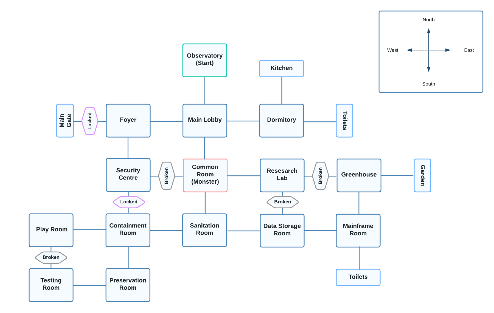
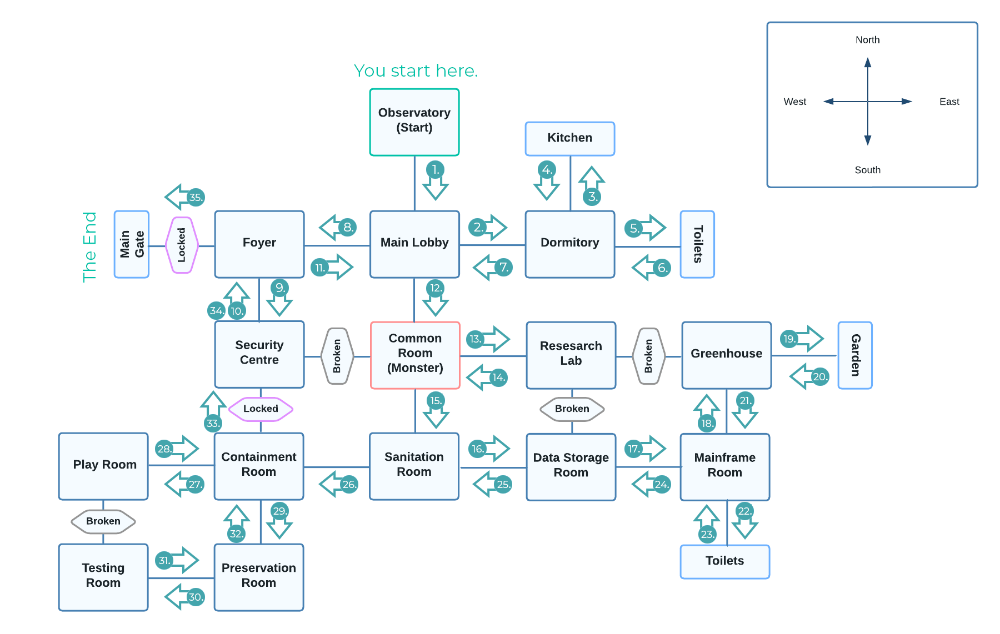

# Avarice

### A website for a CLI horror-themed text adventure.

[Avarice - Live Website](https://avarice-txt.herokuapp.com/)

  

Everyone plays games in this day and age. Consoles and gaming PCs are more common than ever, and one can't forget about the advent of mobile phones gaming. It's a fun little distraction (and sometimes not-so-little) to immerse yourself in a different world and universe. You can be somebody else, living a different life, with different problems. It works well as both escapism and as a means of self-realisation, as games can sometimes be more than just fun experiences depending on their thematic principles and any lessons those might carry. Additionally, text-heavy games can enhance user comprehension and volcabulary as it's not that different from reading a book. After all, what is a text adventure if not an interactive novel?

I wanted to pay homage to the video games of the 1980s, which paved the way forward for action, adventure, and even horror games! The likes of "Zork" and "Spunky Spelunky" are what really inspired me to create a text adventure of my own. However, I wanted to create a horror themed text adventure inspired by the likes of the "Resident Evil", "Evil Within", and especially "Alien: Isolation". The idea was to have a potent adversary pursuing the player throughout the game as the player attempts to accomplish their objective. This becomes innately more difficult due to the lack of both visual and audio components, leading to the entire focus being shifted to the, well, the text! By that I mean the writing and its ability to establish a scene and create a forboding atmosphere that lasts throughout the course of the game.

This is my third milestone project as part of Code Institute's Diploma in <strong>Software Development (E-commerce Applications)</strong>.

For this project, I decided to create a horror-themed text adventure game using Python. The key concept for this project is greed and this is wholly reflected in the game's title: "Avarice". The chosen monster is loosely based on a Wendigo from Algonquian-speaking First Nations in North America. Wendigos, amongst all mythical creatures, are the ones that best embody greed and gluttony. This is precisely why this game will explore the concept of greed and especially excessive and destructive greed in multiple aspects throughout.

This application is accessed by the player using the command line interface (CLI). It's hosted on Heroku and is displayed via the provided template JavaScript and HTML, which has not been altered in any way. There's no save-game function as this text adventure is intended to be played from start to finish in a single sitting or two, being easily finishable within 30 minutes or so. There multiple endings available, however, once the player figures out how to deal with what the game throws at them, replaying the game for the other endings will not be difficult or time consuming at all.

## How to Play

My vision for this game was for the player to have complete freedom within the game's world, and this is accomplished by four actions.

1. "Move"
2. "Examine"
3. "Hide"
4. "Recall" 

The "Move" function is what truly frees the player up, as it allows them to choose which cardinal direction to move in and let's them explore the world on their own terms. They are, of course, limited by the map and any obstructions it may have.

"Examine" allows the player to examine certain objects within each room to learn more about the room, and maybe even find items.

The "Hide" action is the key method in how the player deals with the monster: by hiding. Each room has predetermined objects and locations to use to hide themselves. Of course, not all of these locations are good, and as such, they aren't recommended to the player.

Lastly, "Recall" allows the player to recall what they remember of the room upon entering it for the first time. This allows for the player to not be bombarded by information upon revisiting a prior room.

## Table of Contents

1. [Project Goals](#project-goals)
    - [User Goals](#user-goals)
    - [Creator Goals](#creator-goals)
2. [User Experience](#user-experience)
    - [Target Audience](#target-audience)
    - [User Stories](#user-stories)
3. [Game Design](#game)
    - [Narrative](#narrative)
    - [Typography](#typography)
    - [Colour Scheme](#colour-scheme)
    - [Map & Flowcharts](#map--flowcharts)
4. [Code](#code)
    - 
    - [Folder Structure](#folder-structure)
    - [Constants](#constants)
    - [Helper Functions](#helper-functions)
    - [Game Loop](#game-loop)
    - [Actions](#actions)
    - [Map Design](#map-design)
    - [YAML](#yaml)
    - [Data Model](#data-model)
5. [Validation](#validation)
    - [Python Validation](#html-validation)
    - [YAML Validation](#css-validation)
6. [Testing](#testing)
    - [Play Testing](#play-testing)
    - [Testing User Stories](#testing-user-stories)
7. [Bugs](#bugs)
8. [Future Updates](#future-updates)
9. [Deployment](#deployment)
10. [Technologies Used](#technologies-used)
    - [Languages](#languages)
    - [Python Libraries](#python-libraries)
    - [Frameworks & Tools](#frameworks--tools)
11. [Credits](#credits)
12. [Acknowledgements](#acknowledgements)

## Project Goals

The aim of this project is:
- To demonstrate my knowledge of Python, to document my experiences, difficulties, and solutions developed. No other languages or frameworks were used in the development of this project.

### User Goals

- Find a text adventure to play
- Find a suspenseful game that establishes a foreboding and threatening atmosphere
- Find a game that will help improve user comprehension, information retention, and volcabulary
- Explore horror tropes regarding mythical monsters and a ruined facility
- Have total freedom in how to explore the game
- Interact with the environment to learn more about the game world
- Have control in how to deal with the monster
- Read the displayed text at a comfortable speed
- Experience multiple endings depending on choices made

### Creator Goals

- Provide a text adventure game to play for fans of this type of game
- Provide a suspenseful horror game that focuses on creating a threat that pertsists throughout the game
- Present horror trophes in a unique and engaging manner
- Give the user freedom by providing them with actions to roam the world and interact with objects within it
- Give the users options with regard to where they can hide
- Allow the text to displayed with a slight delay such that it doesn't get printed instantly
- Provide the user with multiple endings depending on what choices they make throughout their journey

[Back to Top &uarr;](#avarice)

## User Experience 

### Target Audience

- People who are looking of a suspenseful albeit enjoyable experience
- People who are looking for a game that consists mostly of reading
- People who are looking for a monster game that explores the monster outside of villainising it
- Fans of horror games
- Fans of sci-fi concepts mixed with horror and mystery elements
- People who are looking for a free-to-play text based adventure

### User Stories

#### First Time Players

1. As a first-time player, I want to easily understand the main purpose of the game.
2. As a first-time player, I want to learn how to navigate the map and interact with items.
3. As a first-time player, I want to learn about the world and the lore.
4. As a first-time player, I want to learn about the monster and how to deal with it.
5. As a first-time player, I want to know what the criteria for the different endings is.
6. As a first-time player, I want to not be overwhelmed by text appearing on screen.
7. As a first-time player, I want to be able to see previously displayed text within rooms.
8. As a first-time player, I want to see the people who were involved with the creation of this game.

#### Returning Players

9. As a returning player, I want to go through the game to see and experience any endings I have not prior.

#### Site Owner

10. As the creator, I want to provide players with a new horror-themed text adventure game.
11. As the creator, I want users to be able to navigate the map easily and without any confusion.
12. As the creator, I want to adhere to a specific vision in terms of how tropes are handled and provide users with a very engaging game via its text-based gameplay.
13. As the creator, I want to provide a clear explanation of the actions available to the user within the game.
14. As the creator, I want to provide feedback to the users that their inputs for actions are acknowledged.
15. As the creator, I want to provide users with different endings depending on how many objectives they've accomplished, encouraging them to try to seek out all the objectives.
16. As the creator, I want to provide players with a suspenseful and mysterious game that explores the monster and horror themes in a unique way.

[Back to Top &uarr;](#avarice)

## Game Design

As the core goal of this project is to demonstrate my knowledge and understanding of Python principles, most of my and efforts have been focused on doing such. However, narrative design and formatting the narrative to adhere to the 80 character limit of the terminal took a great deal of time. Only minor changes were made to the styling of terminal's webpage on Heroku.

### Narrative

The core direction of the narrative was inspired by the [SCP Foundation](https://en.wikipedia.org/wiki/SCP_Foundation). "SCP" is abbreviated as "Secure", "Contain", "Protect". The wiki website is full of crowd-sourced stories about about odd objects and unusual entities that completely violate natural law. As such, they are founded in our common reality with a few twists and turns. For Avarice, this is exactly the setting I wanted to re-create. The game begins with you, the Investigator, talking to a mysterious broker that tasks you with entering a facility to gather as much information as you possibly can in order to learn about happened there. The broker is intentionally unclear about your task but offers you a great deal of financial compensation, compelling you to accept it. Between your desire for the money and a strained relation with your estranged spouse, you set out on your task.

Upon arriving at the designated location, you find a completely run down facility. Despite looking rundown, it seems sealed off from the inside and abandonded. As such, you find an entrance in the un-barred window on top of the observatory tower, at which point the game proper begins. Information is presented organically to the Investigator as they navigate through the facility, interact with objects, hide from the monster, all while trying to locate the key items necessary to uncover the secrets of this place and escape. Upon re-entering any room, a shorter summary is shown to prevent overwhelming the user with information and text.

The key items are accompanied by some of the larger blurbs as they contain the most relevant information to the Investigator and their task. Acquiring the keycard allows the Investigator to leave at any point, otherwise two more different endings are available if the player gets some of the key items alongside the key or all of the key items and the key itself. Additional endings were planned but unfortunately fell out of the scope due to the deadline.

The tutorials are diegetic and help to expand on the Investigator's personality, while also explaining how to interact with the game. The player is asked for a name but this name is mostly form a connection with the protagonist at the beginning of the game and place the player in the Investigator's relative shoes. Aside from the this, the protagonist is not referred to by their given name but just as Investigator. Their gender and pronouns are also intentionally left ambigious in order to let the player make that decision for themselves. 

The player is able to piece the narrative together, piece by piece, as they progress through the facility. Each room comes with a shortly albeit a detailed description of the room, notable objects, and general directions. Examining the notable objects will provide a more detailed description and sometimes even a key item. As such, players are encouraged to examine everything. This, in turn, provides another reason to learn as much as possible at the facility in a natural manner. It also explains which areas having hiding spots, as not all hiding spots are made equal. 

Hiding spots of course, become relevant when the monster itself is encountered in the Common Room. At this point, the monster spots the Investigator and chases them. The Investigator is given limited turns to find to hide within a hiding spot they should have found earlier. If a hiding spot is bad, then the monster will be able to find the Investigator, killing them and bringing the game to a pre-mature end. The hiding spots themselves are designed to be more than just the main method of avoiding the monster; they also function as environmental story-telling for the room they're within.

After the monster makes its appearance, it's after this point that the Investigator can examine notable objects that will alert the monster to the location of the Investigator. Due to this, it's important to always move slowly and carefully, as well as remembering the nearest safe hiding spot creating a sense of suspense.

Overall, the narrative focuses on what went on within the facility, a deep dive into the monster and how it came to be, what the facility was experimenting, and their attempt of fusing flora and fauna. The scientists also performed tests on plants, which in turn, caused nature to bite back in its own way. The monster was created out of corporate greed and a desire to create an unstoppable force, kept secret to the governments of the world. Unfortunately, this didn't come to fruition, and the monster's development was halted short as its creator's excessive greed ended up overcoming the monster itself, causing it to spiral out of control. But maybe, just maybe, it still is a lonely creature that's looking for a reason to belong...

The monster itself is very loosely inspired by Wendigos from Algonquian-speaking First Nations in North America. Wendigos tend to be very malevolent entities that are definited by their excessive greed, which as a concept fits the narrative perfectly. However, those in charge of the facility were unsatisified after creating an artificial Wendigo, deciding to create a being that consists of an unholy fusion of flora and fauna. A total and complete perversion of nature. As the core theme is greed and how it brings everything here, to this facility, where they are consumed by it. Even nature itself decides to fight back against it, slowly overtaking the facility, bit by bit. But maybe, just maybe, the Investigator will be able to end this cycle of never-ending avarice. 

Below you may see Kate V.'s sketch rendition of our vision for the wendigo. It retain its usual deer skull combined with antlers, which are flowering due to the experimentation it was submitted to. Its exposed ribcage with four hearts is visible, however only two remain after the incident that occurred within the facility. It otherwise has an emanticated frame accompanied by lanky and lethal limbs.

A lot of narrative elements within the facility are left intentionally vague, so as to not to provide the player with all the answers. After all, some mysteries are best left unsolved and up to the imagination of the audience.

### Typography

ASCII art was used for the Start and End titles, using the "ANSI Shadow" font. This particular font was chosen due to its heavy and blocky shapes, which is further enhanced by the thin outline of it's shadow, creating an easy to discern 3D look that helps captivate the user. The titles were generated using [patorjk's Text to ASCII Art Generator](http://patorjk.com/software/taag/#p=display&h=0&v=0&f=ANSI%20Shadow&t=Avarice).

### Colour Scheme

Colours were generated for the titles mentioned above using [patorjk's Text Colour Fader](http://patorjk.com/text-color-fader/), which were then converted from HEX to RGB and added to strings as an escape sequence using the information found on this [Stack Overflow thread](https://stackoverflow.com/questions/4842424/list-of-ansi-color-escape-sequences). 

For the start and end titles, the following colours were used:

- #ff2a2a: \033[38;2;255;42;42m
- #fe3b3b: \033[38;2;254;59;459m
- #fe4e4e: \033[38;2;254;78;78m
- #ff6161: \033[38;2;255;97;97m
- #ff7d7d: \033[38;2;255;125;125m
- #ff9b9b: \033[38;2;255;155;155m

The colours used start as a bright red and slowly fade into a soft pink, and altogether this effect creates a very striking looking title on the black background. The contrast is very effective and it suits the general bloody theme of the game.

Additionally, for inputs the text is changed to a reddish brown to help differentiate between inputs and outputs.

- #bf6148: \033[38;2;191;97;72m

### Map & Flowchart

The map of the facility was created by looking at existing maps of similar facilities in other games, as well as real world facilities. This research was carried out in order to create a cohesive structure that made sense from a design perspective, flowing almost seamlessly from one section into another. This map was created via [Lucidchart](https://www.lucidchart.com/pages/).

The map shows the starting area relative to the rest of the facility, the room the monster is first encountered, all the locked paths, all the blocked paths, and all the dead-ends. A compass is provided for additional clarity of where each room is located in relation to each other.

Furthermore, a flowchart was created using this map in order to present one route that a player may take in order to complete the game. Please note that this flowchart only shows one of many combinations of routes that the player can take and doesn't take into the player alerting the monster into account. This path explores the entirety of the map and covers the route one would take to acquire all items in order to achieve the most complete ending.

1. Examine the CCTV monitors within the Security Center. The player will realise they need a battery to power the devices in order to obtain the CCTV footage.
2. Examine the drawers within the Research Lab. The player will find research documents on the monster within.
3. Examine last functional computer within the Mainframe. The player will be able to get a battery to power the CCTV devices within the Security Center.
4. Examine the hand sticking out of the dirt grave in the Garden. This will grant the player the keycard, allowing them to open any locked doors.
5. Examine the chest-cavity within Testing. This will grant the player the Development Records on the monster.

At this point, the player can leave to achieve the main ending of the game.

In order to avoid the monster, it's important to remember where the good and bad hiding spots are.

[Back to top &uarr;](#avarice)

## Code

This section covers the approach to coding this project, with any new approaches being detailed alongside the rationale for them. A mostly object-orientated programming approach was taken in this project, with a heavy reliance on classes and methods within them. A lot of classes that weren't being used? were later changed to dataclasses as this made them both easier to work with and more effective in general.

### Commits

- `git status` was used far more frequently to avoid committing anything I didn't intend to and this helped with keeping the commits down in size.
- If any errors were made in the commit message, `git commit --amend` was used to edit it.
- If a file was unintentionally added, `git restore --staged file` was used to rectify this.
- If a commit couldn't be aptly summarised or was bigger than usual, `git commit -v` was used to stage commits for two reasons: 1) to see the visual comparison of the old code and the new code, and 2) to write a more detailed description under the commit message. `git diff` also accomplished a similar need.
- The imperative mood was used throughout all messages and descriptions.
- There were a handful of bigger commits and this was primarily due to the mass refactoring of code which took changes in multiple places. This did, however, make the code much easier to read and work with.

All of the above allowed for more precise and correct version control.

### Folder Structure

`run.py` was changed to `game.py` due to the nature of this project, and it was then spread into many more modules, helping organise the game in a manner that's easier to process and work with. These modules were then moved into the `src` (source) folder, which only holds them, making it much easier to navigate between the source code files amongst everything else. I noticed this was common practice when developing games and helps keep everything organised.

The `.yml` files were also moved into their own folder, `avarice_yaml`, so as to adhere to the principle that led to the Python files being placed into the `src` folder.

`default.js` was edited as necessary in order to account for the change that `game.py` was no longer in the root folder for Heroku.

### Constants

All constants are located within the `constant.py` module. It holds all the relevant constants that use up a lot of lines and allow for easier editing of constants, as it's much easier to change them in one place than it is many other places.

As it stands, `START_TITLE`, `END_TITLE`, and `GAME_OVER` are present within this file. All of the three aforementioned constants also have escape sequences within them and this allows those lines to not be over 80 characters. `STARTING_POSITION` is also present here incase the player's starting position is ever desired to be changed.

### Helper Functions

Helper functions are located within `helper.py` and contain useful functions that are used in the game loop. `p_t()` is an abbreivated way of writing `print()` that also uses less characters and adds a slight delay to enhance readibility via `time.sleep()`. `get_str(question)` carries out a similar task but does more: primarily stripping any white-space from any input, printing an error message upon a blank input, and also adding an escape sequence in order to differentiate the questions towards the player versus the regular game text.

### Game Loop

The game loop begins by printing the `START_TITLE` and inquiring if the player would like to proceed with the game, which only takes "Yes" or "No" answers. This, alongside all of the other Y/N questions within the game loop has been coded such that any answer starting with "y" is read as an affirmative answer, and any answer beginning with "n" is read as a negative answer. This is done so that players have room to answer with different answers like "yeah", "yea", "yep", "nah", "nope", and so on. This was a very popular choice with all the play testers. It also allows for typos.

If the user responds with a negative answer, however, the game ends and the player is brought to the `END_TITLE` screen. The credits do not play here.

If the user responded with a positive answer, the player's starting position is assigned via a constant and they are then asked for their name, which is then printed back to the terminal to acknowledge the selected name. Any sort of name is allowed, unless it is blank, in which case the question is asked again.

The player is then asked if they want to view the briefing, which acts as the intro, after which point the player is spawned at the starting room and actions are assigned to them.

The game proper begins at this point and the first tutorial plays, after which point the player is thrust into the game.

### Actions

As mentioned before, there are four actions in this game: 1) Move, 2) Examine, 3) Hide, and 4) Recall.

### Map Design

The world and the map of the facility began as a x, y coorindate plane and was structured as a 2D list or a list of lists. The x-plane represents the horizontal position of rooms and the y-plane represents the vertical position of rooms.

It was first [created in Excel](docs/excel_map.png) in order to gain an understanding of how each room correlated to each other. A typical coordinate plate begins in in the bottom left corner, but in game design the y-axis is flipped such that the numbers increase upward instead of decreasing downwards. This is mainly to avoid dealing with negative coordinates, which can get overwhelming and confusing very easily.

Paths were then added between the rooms, and it was during this process that I realised that this data could be displayed in a much more user-friendly manner. It was at this point that the rooms and paths were switched to `.yml` files.

### YAML

serialisation and reserialisation of lists to make them more user-friendly. people can clone and edit the files to create their own world & games.

### Data Model

## Validation

### Python Validation

[PEP8 Code Institute Linter](https://pep8ci.herokuapp.com/) was used to validate Python code. No errors were found. 

- While working on the project in GitPod, pylint detects a warning for attribute names "x" and "x" as they don't conform to snake_case naming style. This is a non-issue within the PEP8 and linter and as the map created for this project is a x, y coordinate map, "x" and "y" were chosen as the attribute names. "x-co" and "y-co" were entertained as alternative names but it made the code even more confusing to work with in addition to it being difficult to adhere to the 80 character limit.

[X & y Snake Case Name Warning]()

### YAML Validation

[YAML Lint](https://www.yamllint.com/) was used to validate YAML code. No errors were found. 

- Errors were detected in GitPod, stating that there were "unresolved tags". This was researched and explored as much as possible, including reading more than a handful of Stack Overflow threads and open issues on GitHub. It appears that this could be resolved via the addition of custom-tags to the the `settings.json` file but unfortunately, even using a mixture of recommended custom tags, it wasn't possible to resolve these errors. Ultimately, the linter doesn't detect any issues and the code works exactly as intended, so these errors were ignored.

[Unresolved Tag Errors]()

[Back to top &uarr;](#avarice)

## Testing

### Play Testing

The game was play tested during all stages of development, this is how the bugs that are detailed in the bugs section were found. Each function was tested and any bugs were documented as soon as they were found. They were then solved, and this solving process was also documented. 

The play testers also provided some very helpful feedback:
- "N", "S", "E", and "W" for movement alongside "North", "South", "East", West", and "Go North" and etc. This helps to speed up the process of moving around the map as this is a very common input.
- Do not implement capitalisation check for Investigator name as some players prefer lowercase names as well as names made entirely out of numbers.

### Testing User Stories

1. As a first-time player, I want to easily understand the main purpose of the game.
    - Upon running the application, the user is automatically greeted with a clean and distinctive title screen. The tone of the game is very quickly established after this with the player being asked if they're interested in playing.
    - At this point, players can choose a name and whether or not to view the introduction, after which point they're thrown into the game where the tone and atmosphere is slowly established.

2. As a first-time player, I want to learn how to navigate the map and interact with items.
    - With the help of a diagetic and unskippable tutorial that plays right after the introductory scene, the player is introduced to their actions and how to use them. Both the Move and Examine actions are covered within this.

3. As a first-time player, I want to learn about the world and the lore.
    - By simply navigating the world, the player is able to learn a lot about the world and its lore.
    - Additionally, by examining certain items the player is able to learn even more.
    - Key items expand on this even further, often containing vital information.

4. As a first-time player, I want to learn about the monster and how to deal with it.
    - Upon entering the Common Room, which is unavoidable, the monster is introduced, and in doing so, the player is met with another diegetic tutorial that teaches them the Hide action.
    - At this point, examining certain objects will make it clear that it's possible to hide near, behind, under, or inside of them.

5. As a first-time player, I want to know what the criteria for the different endings is.
    - By playing through the game and managing to escape, the player is informed of how successful they were during their investigator and how many (if any) of the key items they obtained.
    - As such, it is easy to infer how many other alternative endings exist dependant on the goals accomplished.

6. As a first-time player, I want to not be overwhelmed by text appearing on screen.
    - Via the use of the `p_t()` function, text is delayed by 0.75 seconds and is only printed after that period of time has elapsed.
    - Additionally, no more than one portion of text is printed to the terminal at any given time, with actions causing more or less text to be printed.
    - Re-visiting areas prints less text, allowing for an easier navigation experience.

7. As a first-time player, I want to be able to see previously displayed text within rooms.
    - Using the Recall action, the player is able to view the longer description of any room they choose. 

8. As a first-time player, I want to see the people who were involved with the creation of this game.
    - Upon the completion of the game, credits are displayed that show the developer, writer, and name honourable mentions that had a had in shaping this game.

9. As a returning player, I want to go through the game to see and experience any endings I have not prior.
    - Once the route to finish the game is made known the player, going through the game again will be much easier and quicker.
    - As such, all the player will have to do is prioritise obtained some or all of key items to trigger the different endings.

10. As the creator, I want to provide players with a new horror-themed text adventure game.
    - By hosting the game on Heroku, players can experience the game without having to download it and run it locally.
    - It is completely free to play and available to absolute any one looking for both horror-themed game.

11. As the creator, I want users to be able to navigate the map easily and without any confusion.
    - Through the use of a simple and diegetic tutorial, the player is introduced to the move commands.
    - In addition, the commands are simple and straightforward, and accept different inputs (n, north, move n, move north and etc).
    - If the player moves in a direction where there's either a wall or the path is blocked, this is acknowleged and a message is printed to the terminal.

12. As the creator, I want to adhere to a specific vision in terms of how tropes are handled and provide users with a very engaging game via its text-based gameplay.
    - Through careful brainstorming and planning, the narrative was delicately crafted in order to provide a unique albeit slightly familiar experience.
    - Text is carefully formatted and space, making sure it is consistent and easy to read.
    - The game is written in the second person perspective, and aims to place the player in the shoes of the protagonist. Everything happens through the player's eyes.

13. As the creator, I want to provide a clear explanation of the actions available to the user within the game.
    - The game's use of multiple diegetic tutorials let the user be clearly aware of the actions that the game revolves around.

14. As the creator, I want to provide feedback to the users that their inputs for actions are acknowledged.
    - Players' input is always printed back to the terminal, such that they are able to see what their previous inputs were.
    - Invalid inputs print a message saying that the input or action wasn't recongised and that they should try again.

15. As the creator, I want to provide users with different endings depending on how many objectives they've accomplished, encouraging them to try to seek out all the objectives.
    - One of three endings are available to the player depending on when they leave the facility and with how many of the key items.
    - Each of the endings, while somewhat similar in that they all end with the player escaping, provide an interesting bit of lore regarding the mysteries in of the that protagonist and/or the monster.

16. As the creator, I want to provide players with a suspenseful and mysterious game that explores the monster and horror themes in a unique way.
    - Through the use of the second person perspective during the narrative, the freedom of choosing whichever path the player likes, and the looming threat of chasing monster, the player is put under suspense throughout the game.
    - The exception to this is the beginning of the game, which is the figurative calm before the storm and establishes the overall atmosphere and world.
    - The monster is also portrayed less as an mindless and malevolent being and more as a complex albet intimidating entity.

[Back to top &uarr;](#avarice)

## Bugs

| Bug  	| Intended Outcome 	| Issue 	| Cause 	| Solution 	| Commit 	|
|---	|---	|---	|---	|---	|---	|
| #1 	| Player starts at the Observatory. 	| Player started at the Security Center. 	| Starting coordinates were set to (1,2). 	| Set the starting coordinates to (2,0). 	| [2ebce79](https://github.com/Ryael/avarice/commit/2ebce79799ae9b44ea3f13ff2c00dd23f40dfda1) 	|
| #2 	| Player can only navigate to existing rooms within the world. 	| Player can go into "None" areas, where there are no rooms. 	| No check was implemented to see if the room direction being moved into had an existing room. 	| Add walls such that they prevent the player from falling off the map. `valid_move` checks the area the player is trying to move into to make sure it exists. 	| [9a072eb](https://github.com/Ryael/avarice/commit/9a072eb9e05671090164691f669f041d29396d91) 	|
| #3 	| Player is able to move in all cardinal directions. 	| Player is only able to move south, all other directions print a message that says no valid path exists. 	| What was being checked via `valid_move` was the room coordinates, starting at (0,0). 	| Instead of room coordinates, check the player's move coordinates from the starting position. 	| [177ad5e](https://github.com/Ryael/avarice/commit/177ad5e532f311ae457551d69ae5a2ad1fe8c3e0) 	|
| #4 	| `intro_text` is only printed upon a successful movement action, otherwise only the failed move text should be printed. 	| `intro_text` for every room is printed even after a failed move. 	| No default state for the room existing had been set. 	| Add `self_moved` and set it to `True`. If a room doesn't exist, then set it to `False`. Also add an if statement to `start_game` to make sure the `intro_text` is only printed when a valid move is made: `self.moved = True`. 	| [d0bba8a](https://github.com/Ryael/avarice/commit/d0bba8a8ce25944e7ffdc90e523079d8980bf040) 	|
| #5 	| Player can only access rooms that are directly linked to each other. 	| Player can move between rooms that aren't directly linked and are only separated by empty space. 	| No check was implemented to see if there was a valid path between any given rooms. 	| Paths were added with a check to see if there was a valid path between rooms, or if the path was either blocked or locked. 	| [fa5a441](https://github.com/Ryael/avarice/commit/fa5a441c0fc9b158667bb5363fe8ec3e72cef790) 	|
| #6 	| Player should be able to move through all open paths, but not through locked or blocked paths. 	| Player was able to move through locked and/or blocked paths.  	| If statement was set to `if path.block and path.lock`, but no path was both locked and blocked. Additional, `return` was incorrectly indented within in `def find_path()` at the very end. 	| Set the if statement to be `path.block or path.lock` and un-indent the `return` at the end of `def find_path()`. 	| [e763e32](https://github.com/Ryael/avarice/commit/e763e32c75323e069b0aa78e20e80a1f4f8622ef) 	|
| #7 	| Player can access Testing from Preservation. 	| Player can't access Testing from Preservation. 	| No path existed between these two rooms. 	| Add a path between these two rooms into the paths array. 	| [ac8a458](https://github.com/Ryael/avarice/commit/ac8a458fe514476134845d23fed7abe1a60426f3) 	|
| #8 	| `iadd` should return assigned and updated (x, y) coordinates to reflect the movement of the player. 	| `iadd` was not returning the assigned and updated (x, y) coordinates. 	| The updated (x, y) coordinates were not being returned. 	| Add `return self`. 	| [6011328](https://github.com/Ryael/avarice/commit/6011328dbf9d58716a4098c41b6d004db32b782d) 	|
| #9 	| First question should repeat even if the input is invalid (neither yes nor no). 	| Invalid input during the first question causes the game to end. 	| No while loop. 	| Add a while loop. NOT FINISHED	|  	|
| #10 	| When asked if the player wants a briefing, an invalid input should prompt the user for another input. 	| When asked if the player wants a briefing, an invalid input prints a statement saying that the input has to be a Yes or a No, however the briefing is still skipped and the game continues. 	| No while loop. 	| Add a while loop. NOT FINISHED	|  	|
| #11 	| When the player inputs an invalid move action, the description of a room is not printed. 	| When the player inputs an invalid move action, the description of the move is printed. 	| No while loop to check. 	| Add a while loop. NOT FINISHED 	|  	|

[Back to top &uarr;](#avarice)

## Future Updates

1. Additional Endings - Initially, examining the ladder at the very beginning of the game was meant to prompt a silly and grim ending. Additional items were also considered to be included, which would have the player make a choice if they were to meet certain secret criteria before escaping. Once met, the path would split from this point on. One choice would have the player continuing playing the game after the ending, wherein they revisit the facility and are able to unlock an entirely different ending. The other choice would allow for a unique and secret ending scene depending if all the secret criteria was met. These endings and ideas were unfortunately cut from the base game due to the scope being too big.

2. Lore Expansion - Expanding on the vital information provided by the key items whenever the player examines them within their inventory is something I'd like to do ASAP. With this, information can be provided diegetically and organically to the player with regards to what transpired here as the game in its current state may leave the player with more questions than answers.

3. Extra Modules - Instead of capitalising examinable items, I'd like to colour them in a different colour. This should be much easier on the eyes and hence easier to process for the players. Perhaps centering the text and having it use full width of the terminal could make for an easier and smoother experience, too. This would allow me to expand the writing and describe rooms in more detail.

4. Fitting & Responsive Environment - It is my vision to create a website that has the terminal sit in the middle and is responsive for certain mobile devices, perhaps by switching the amount of rows with the amount of columns. I'd also like to design the website that contains the game to feel like an old computer screen, adding an extra layer of immersion.

5. Bigger Facility - I'd like to expand the facility to have more floors. This is precisely why the stairs are inaccessible. Multiple floors would allow for more rooms, more items, more interactions, and more ways to interact with the monster.

6. Monster AI - Expanding on the monster AI and giving the player more actions to be able to distract the monster whenever it acts as a roadblock in blocking a path would provide for a more suspenseful and difficult experience.

7. Rotate the Map - It's difficult to randomise the location of the items due to the the importance of their containing locations, hence a simple rotation by +- 90° would disorientate players who were familiar with the map. Additionally, while items can't be randomised, perhaps it'll be easier to randomise sets of certain rooms that belong close to each other and how their paths connect.

8. NPCs - NPCs weren't planned initially but it would be an interesting addition, as this could impact the ending achieved. Adding a rescuable NPC that the player can potentially kill by bringing the monster to them accidentally would add another layer of complexity and suspense. 

I'd like to revisit this project in the future after having learned more about Python, YAML, and game design in general in order to push this application to become as good as it can possibly be. It's something I thoroughly enjoyed working on and have grown quite a bit as a developer.

## Deployment

This project was deployed to Heroku using the following steps:

1. Log in to Heroku, creating an account if necessary.
2. Click the button labeled "New" from the dashboard, under the header in the top right corner.
3. Enter a unique name for the application. For this project I combined the name of the application, "Avarice", with a hypen and "txt" due to to being a text-adventure (avarice-txt).
4. You will then be asked for your region so select one that suits you the best.
5. Once your name has a green tick beside it, showing that it's unique, and you've selected the correct region, you can then click the "Create App" button.
6. From your newly created project page, click locate and click the "Settings" tab and then scroll to the "Config Vars" section.
7. Click the button labeled "Reveal Config Vars" and enter "PORT" into the the "KEY" input field, then enter "8000" into the "VALUE" input field. Click the button labeled "Add" to add the Config Vars.
8. On the same "Settings page", scroll further down to the "Buildpacks" section and click on the button labeled "Add buildpack".
9. Type "Python" in the search bar and select it. Click "Save Changes". Repeat this again for "node.js". Ensure the Python buildpack is listed above the node.js buildpack. If it isn't, you can click on the Python buildpack and drag it upwards to change its position in the list.
10. Navigate to the tabs at the very top of the "Settings" page and then click on the tab labeled "Deploy".
11. Select GitHub as the method of deployment, confirming that you want to connect to GitHub when asked.
12. Search for your repository name, and then click the button labeled "Connect" to link your repository.
13. Lastly, scroll down to the bottom of the "Deploy" page to select your preferred deployment type.
    - You can either choose "Enable Automatic Deploys", which will enable automatic deployment whenever you push updates to GitHub.
    - Or you can choose to manually deploy the application whenever you choose by selecting the correct branch ("main", by default) from the drop-down menu and click on the button labeled "Deploy Branch".

It can also be forked via the following steps:

1. Log in to GitHub and locate the repository again, as described above.
2. At the top right corner of the repository, you will see a "Fork" button. Click on it.
3. You will then be asked where you want to save it, so choose a location.
4. You now should have a copy of this repository in your own GitHub account.

[Back to top &uarr;](#avarice)

## Technologies Used

### Languages

- Python
- YAML
- HTML
- CSS 3
- JavaScript

### Python Libraries

- [PyYAML](https://pypi.org/project/PyYAML/) - PyYAML is a YAML parser and emitter for Python.
- [Dataclasses](https://docs.python.org/3/library/dataclasses.html) - This module provides a decorator and functions for automatically adding generated special methods such as `__init__()` and `__repr__()` to user-defined classes.
- [Time](https://docs.python.org/3/library/time.html) - This module provides various time-related functions.

### Frameworks & Tools

- [GitPod](https://gitpod.io) - IDE used to code and build this project.
- [GitHub](https://github.com/) - The repository was created here, is currently stored here.
- [Heroku: Cloud Application Platform](https://www.heroku.com) - Used to deploy the application and host a mock terminal.
- [Lucidchart](www.lucidchart.com) - Used to create the map and flowchart for the game.
- [Obsidian](https://obsidian.md/) - Used to take notes and create to-do lists.
- [Sublime Text](https://www.sublimetext.com/) - Text editor used to code offline when GitPod was giving errors and during any internet outages.
- [Adope Photoshop](https://www.adobe.com/products/photoshop.html) - Used to crop, resize, and edit images.
- [Favicon.io](https://favicon.io/) - Used to create a favicon.
- [ShareX](https://getsharex.com/) - Used to take screenshots and gifs.
- [Badgen](https://badgen.net/) - Used to generate live badge icons.
- [Text Color Fader](http://patorjk.com/text-color-fader/) - Used to create gradients for the title text.
- [Text to ASCII Art Generator](http://patorjk.com/software/taag/#p=display&h=0&v=0&f=ANSI%20Shadow&t=Avarice) - Used to generate the title text for the start and end of the game.
- [ASCII Frames](https://texteditor.com/ascii-frames/) - Used to generate room name-plates and for the credits.
- [Markdown Tables Generator](https://www.tablesgenerator.com/markdown_tables) - Used to quickly and easily generate tables for the readme.
- [Character Counter](https://www.character-counter.io/) - Used to quickly count the amount of character per line in order to create a consistent column of text throughout the game.
- [PEP8 Code Institute Linter](https://pep8ci.herokuapp.com/) was used to validate Python code. 
- [YAML Lint](https://www.yamllint.com/) was used to validate YML code.

## Credits

1. [Phillip Johnson's "Make Your Own Python Text Adventure"](https://link.springer.com/book/10.1007/978-1-4842-3231-6) - The code presented and explained here was what gave me my initial boost of confidence that my vision for this project could be accomplished. I heavily modified it and commented every single step of the way to demonstrate my understanding of the complete functionality and concepts employed throughout. It served as a frame of reference with regard to how certain aspects of the x, y coordinate map worked and gaps with bridging this approach to my own vision were filled by my own solutions and ideas.
2. [python-text-adventure by jbussin](https://github.com/jbussin/python-text-adventure) - jbussin's code and readme helped expand on the ideas laid out within Phillip Johnson's book and showed me just how a simple concept can be executed improved upon. It was also what gave me the idea to transition my x,y map from a 2D list to a `.yml` file, as well as the modular structure of the game and its repoistory.
3. [double-agent by Estelindis](https://github.com/Estelindis/double-agent) - Double Agent is a fantastic project and it is the very reason I found how to add colour to the terminal via escape sequences and without relying on any additional Python modules. It was also the place where I found the patorjk resources which proved invaluable. Additionally, one of my functions, `p_t()`, was adapted from their `p_d()`.
4. [Code Institute Template](https://github.com/Code-Institute-Org/python-essentials-template) - This project was first based off the repository created by Code Institute. This template made it very easy to work with in GitPod and came fully ready to deploy on Heroku.
5. [Stack Overflow](https://stackoverflow.com/) - This website was instrumental in me furthering my understanding of Python and YML. It also helped immensely with troubleshooting problems.
6. [Code Institute](https://codeinstitute.net/ie/) - Last but certainly not least, this project wouldn't have been possible without the course and material presented there.

## Acknowledgements 

- [Akshat Garg](https://github.com/akshatnitd) - Akshat is an absolutely amazing mentor that's friendly, knowledgeable, and helpful. He's been super helpful in providing me with suggestions and advice.
- [Simon Waldron](https://github.com/saikez) - This project pushed me a lot and Simon was kind enough to be there for me every step of the way. Whenever I faltered and started feeling the most intense stockholm syndrome, he was adamant I would be able to finish this project and adhere to my vision. I cannot possibly thank him enough for his patience, time, advice, suggestions, and most of all, his eagerness to help me.
- Lu C. - All of the writing within the game was done by her and she did an absolutely stellar job throughout. I'd like to thank her for her endless support and encouragement, especially when I felt overburnded with my vision for this project. Lu easily adhered to my narrative skeleton structure and produced fantastic results.
- Rose S. - Rose was instrumental in helping me proofread this readme as well as the entirety of the game script. You've saved me so much time and hassle, after looking at it for so long I just can't spot errors any longer... so, thank you so much, Rose!
- Kate V. - Kate very kindly provided an amazing sketch of the unnamed monster, which served a great help in the visualisation of it.
- [Phillip Waldron](https://github.com/Philip-Waldron) - Phil helped me build my idea for this product from its infancy, subtly guiding me towards simpler approaches for my ideas. If not for him and his sage advice, I honestly think the scope of this project would have been a huge mistake and I wouldn't have been able to meet the deadline. Most of the concepts and ideas he brought up are ones I carried through into the final build. Thank you so much! It was genuinely super fun to spitball ideas with you.
- [Justin Y.](https://github.com/Lichaes) - Last but certainly not least, Justin provided me with suggestions all throughout my development process to aid me in my approach to this project. He also play tested the game extensively, and without his irreplaceable help, the testing procedure would have taken so much longer. He also had a hand to play in writing the introductory, monster, and ending scenes.
- My family and friends, who have been incredibly supportive and have been instrumental in keeping me motivated throughout this project. Thank you all so much! All of you who helped proofread, test, provide feedback on the game, code, and etc... I couldn't have done it without you all!
- The Code Institute community on Slack - Easy, straightforward, and always willing to help and provide advice.
- Love Sandwiches - Ultimately, it wasn't until we went through this project that I realised that this was something I could do. A lot of the website is loosely based on it, too.

[Back to top &uarr;](#avarice)

